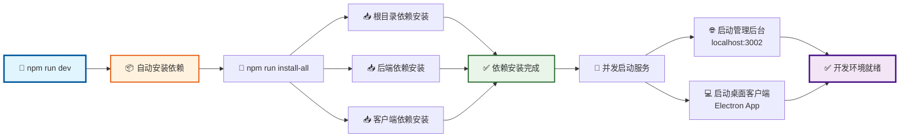
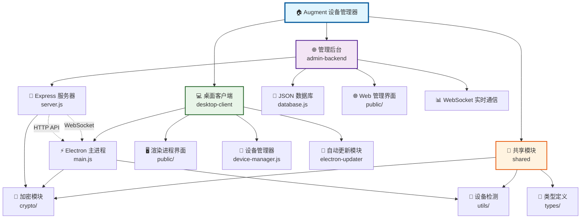
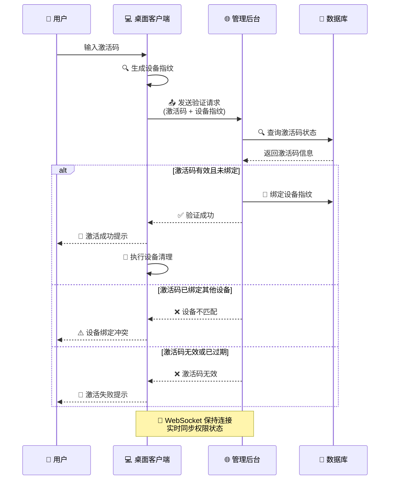
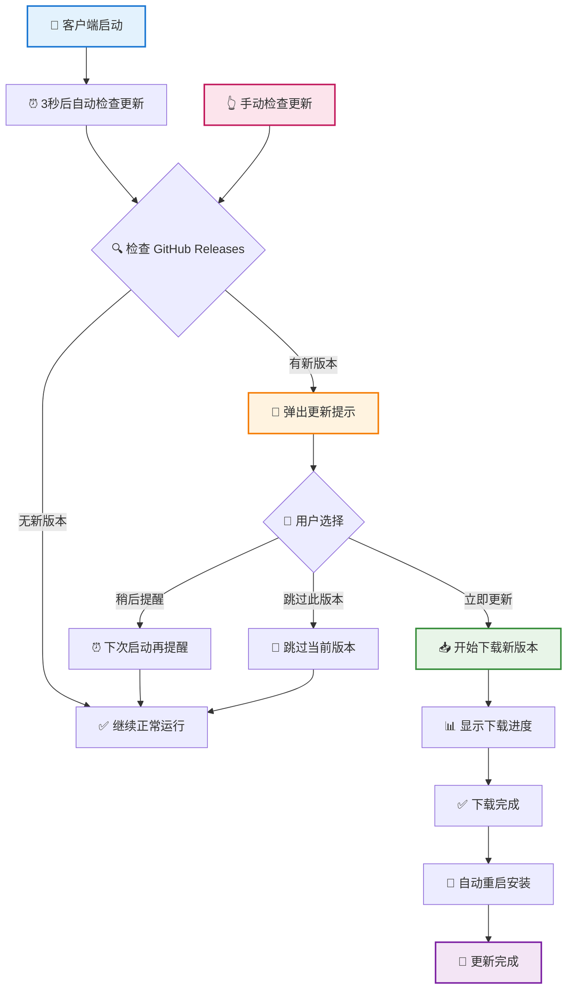

# Augment 设备管理器 - 前后端源码

Cursor IDE Augment 扩展设备限制解决方案，包含激活码管理后台和桌面客户端，支持自
动更新功能。

## 🚀 快速启动

### 一键启动（推荐）

```bash
# 自动安装所有依赖 + 启动完整开发环境
npm run dev
```

这个命令会：

- 🔧 自动安装所有项目依赖
- 🌐 启动管理后台服务器 (http://localhost:3002)
- 💻 启动桌面客户端应用

### 启动流程图



### 其他启动方式

```bash
# 仅安装依赖
npm run setup

# 仅启动后端服务器
npm run server-only

# 仅启动客户端
npm run client
```

## 📊 项目架构

### 整体架构图



### 项目结构

```
augment-device-manager/
├── admin-backend/      # 后端服务 (Node.js + Express)
├── desktop-client/     # 桌面客户端 (Electron)
├── shared/            # 共享工具和加密模块
└── scripts/           # 启动和安装脚本
```

## 🌐 服务地址

- **管理后台**: http://localhost:3002 (admin/admin123)
- **桌面客户端**: 自动启动 Electron 应用

## ✨ 主要功能

### 后端管理系统

- 🔑 激活码生成和管理
- 📊 用户使用记录统计
- 🌐 Web 管理界面
- 🔄 实时远程控制客户端权限

### 桌面客户端

- ✅ 激活码验证和设备绑定
- 🧹 设备指纹清理功能
- 🔄 **自动更新功能**
- 🖥️ 跨平台支持 (Windows/macOS/Linux)

#### 激活码验证流程



### 🔄 自动更新功能

客户端支持完整的自动更新流程：

- **启动检查**: 应用启动后 3 秒自动检查更新
- **用户选择**: 发现新版本时弹出友好提示
  - "立即更新" - 开始下载新版本
  - "稍后提醒" - 下次启动时再次提醒
  - "跳过此版本" - 跳过当前版本
- **下载进度**: 实时显示下载进度条
- **自动安装**: 下载完成后一键重启安装
- **手动检查**: 支持在"关于"页面手动检查更新

#### 自动更新流程图



## 📦 构建打包

### 打包桌面客户端

```bash
npm run build        # 打包当前平台exe文件

# 或进入客户端目录打包指定平台
cd desktop-client
npm run build:win    # Windows
npm run build:mac    # macOS
npm run build:linux  # Linux
```

### 🚀 发布新版本

```bash
npm run release      # 构建并发布到GitHub Releases
```

**发布流程**：

1. 自动更新版本号
2. 构建所有平台安装包
3. 创建 GitHub Release
4. 上传安装包文件
5. 客户端自动检测到新版本

## 🛠️ 技术栈

- **后端**: Node.js, Express, WebSocket, JSON 存储
- **前端**: Electron, HTML/CSS/JS
- **加密**: AES-256, 设备指纹
- **自动更新**: electron-updater, GitHub Releases
- **跨平台**: Windows/macOS/Linux 支持

## 🌐 远程控制

本项目支持完整的远程控制功能，您可以控制不在同一局域网和地区的客户端。

### 快速开始

**方法一：一键配置（推荐）**

```bash
# 运行远程控制配置向导
npm run setup-remote
```

**方法二：手动配置**

```bash
# 1. 启动后端服务
npm run server-only

# 2. 使用 ngrok 暴露到公网
ngrok http 3002

# 3. 配置客户端连接远程服务器
npm run configure-client your-ngrok-url.ngrok.io 443 https

# 4. 重新打包客户端
npm run build

# 5. 测试连接
npm run test-connection
```

### 详细配置

完整的远程控制配置指南请参考：**[📖 远程控制配置指南](./REMOTE_CONTROL.md)**

支持的部署方案：

- 🚀 **ngrok** - 快速测试，几分钟完成配置
- ☁️ **云服务器** - 生产环境推荐
- 🔗 **内网穿透** - frp、花生壳等工具

## 📋 命令速查

| 命令                       | 功能                    |
| -------------------------- | ----------------------- |
| `npm run dev`              | 🚀 一键启动完整开发环境 |
| `npm run setup`            | 📦 安装所有依赖         |
| `npm run server-only`      | 🌐 仅启动远程控制服务器 |
| `npm run build`            | 📦 打包桌面 exe         |
| `npm run release`          | 🚀 发布新版本           |
| `npm run setup-remote`     | 🌐 远程控制配置向导     |
| `npm run test-connection`  | 🔍 测试远程连接         |
| `npm run configure-client` | ⚙️ 配置客户端服务器     |

## 🤝 技术交流

如果您在使用过程中遇到问题或有更好的建议，欢迎交流讨论：

- 📱 关注公众号「**彩色之外**」获取更多开发技巧和工具分享
- 🌐 访问 [个人技术官网](https://zk-99999.netlify.app/welcome.html) - 超级工具等
  你来用
- 🐛 [提交 Issue](../../issues) 报告问题或建议
- ⭐ 觉得项目有用请给个 Star 支持一下

## 🧪 系统测试

### 自动化测试套件

项目包含完整的自动化测试脚本，验证所有核心功能：

```bash
# 运行完整的系统测试（推荐）
node start-test.js

# 或手动运行测试脚本
node test-system.js
```

### 测试覆盖范围

✅ **管理员登录功能** - 验证登录接口和 JWT 令牌 ✅ **激活码管理功能** - 创建、更
新、撤销、删除激活码 ✅ **激活验证功能** - 客户端验证和实时状态检查 ✅ **用户管
理功能** - 用户列表和状态管理 ✅ **统计功能** - 数据统计和实时更新 ✅
**WebSocket 通信** - 连接建立和消息推送

### 测试结果示例

```
ℹ️ [2024-01-20T10:30:00.000Z] 开始系统功能测试...
==================================================
✅ [2024-01-20T10:30:01.200Z] PASS: 管理员登录成功
✅ [2024-01-20T10:30:01.350Z] PASS: 创建激活码成功
✅ [2024-01-20T10:30:01.500Z] PASS: 激活码验证成功
✅ [2024-01-20T10:30:02.000Z] PASS: WebSocket连接建立成功
==================================================
ℹ️ [2024-01-20T10:30:05.000Z] 测试完成! 通过: 15, 失败: 0
✅ [2024-01-20T10:30:05.001Z] 🎉 系统测试完成，所有功能正常！
```

## 🔧 故障排除

### 常见问题

**Q: 端口被占用怎么办？**

```bash
# Windows
netstat -ano | findstr :3002
taskkill /PID <PID> /F

# macOS/Linux
lsof -ti:3002 | xargs kill -9
```

**Q: 依赖安装失败？**

```bash
# 清理缓存重新安装
npm cache clean --force
rm -rf node_modules package-lock.json
npm install
```

**Q: WebSocket 连接失败？**

- 检查防火墙设置
- 确认后台服务正常运行
- 验证端口 3002 是否可访问

## 📄 许可证

MIT License
