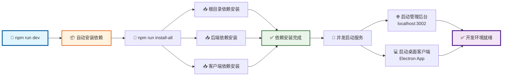
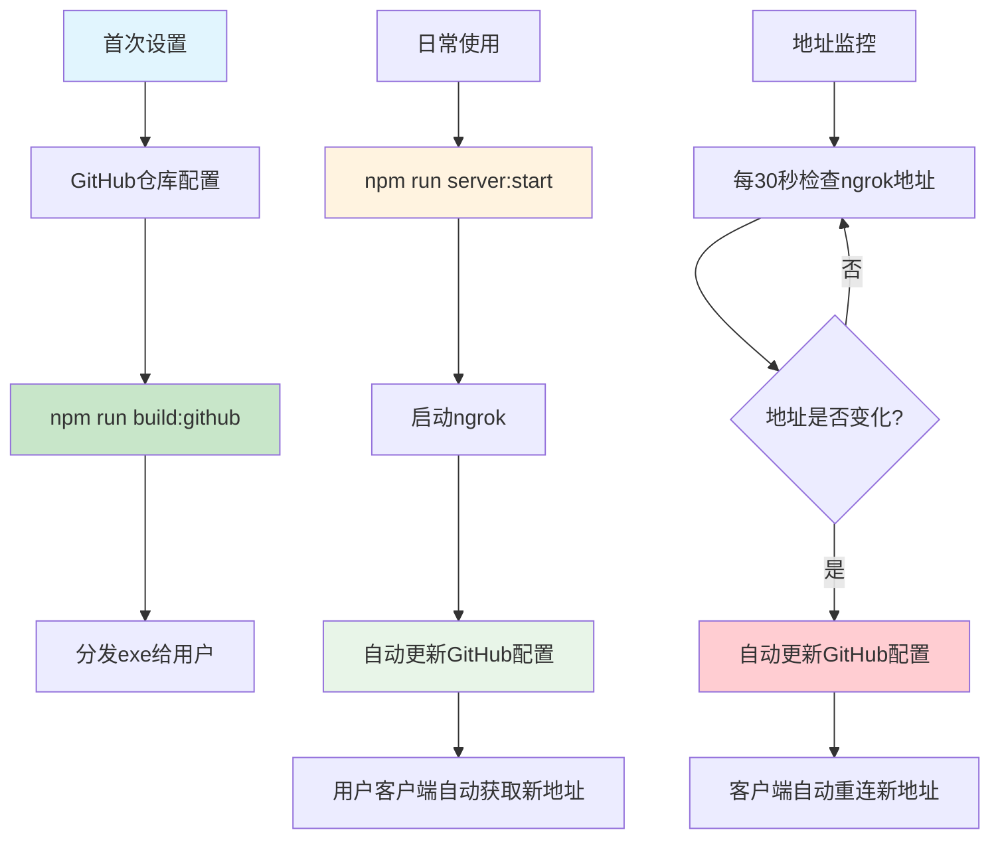
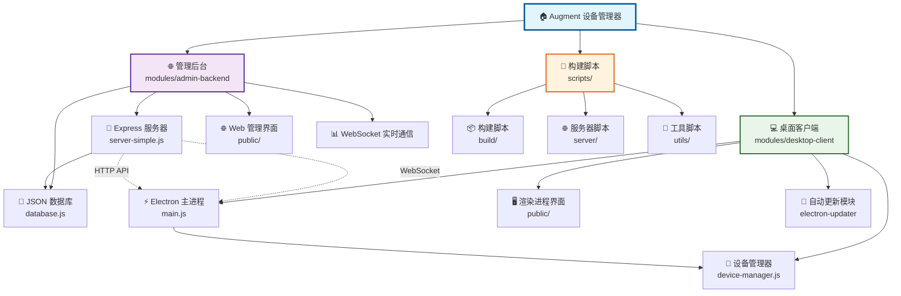
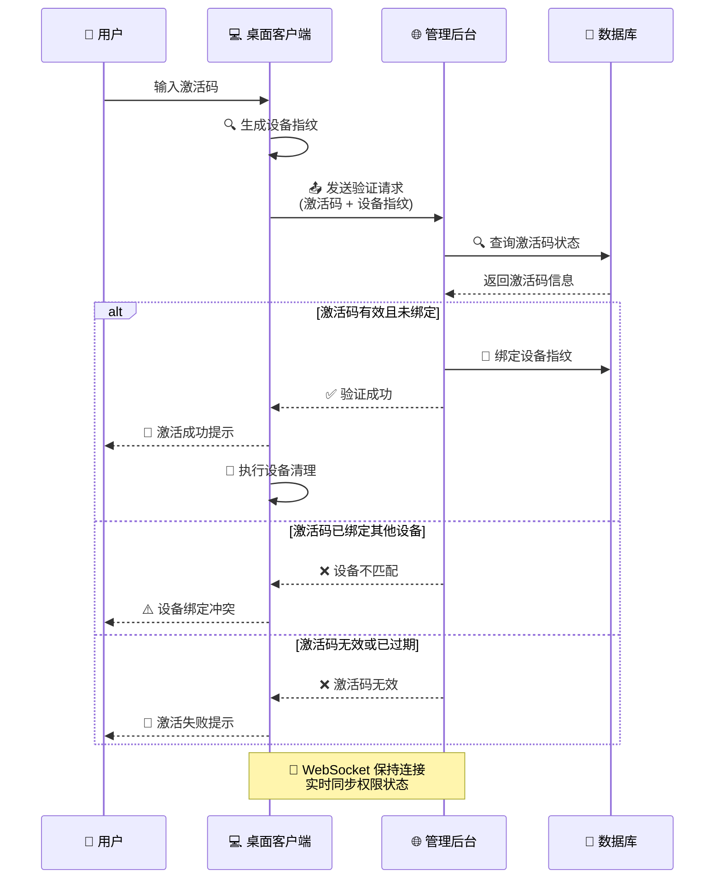
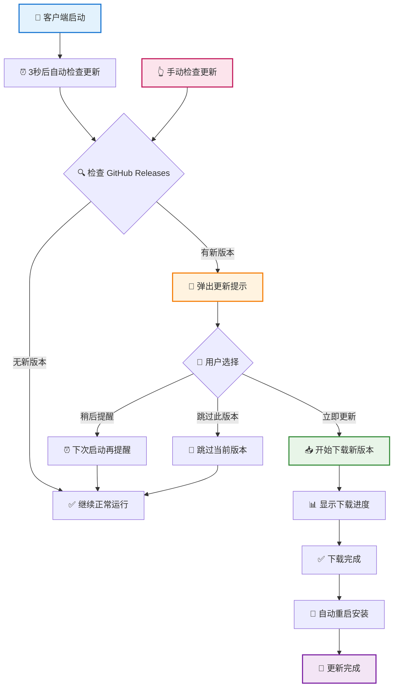

# Augment 设备管理器

Cursor IDE Augment 扩展设备限制解决方案，支持远程分发和自动配置更新。

## 📑 目录

1. [🚀 快速启动](#1--快速启动)
2. [🔄 远程分发流程图](#2--远程分发流程图)
3. [🎯 核心特性](#3--核心特性)
4. [📋 使用说明](#4--使用说明)
5. [🔧 自动监控机制](#5--自动监控机制)
6. [📊 项目架构](#6--项目架构)
7. [📁 项目结构](#7--项目结构)
8. [🚀 快速部署](#8--快速部署)
9. [✨ 主要功能](#9--主要功能)（含激活验证和自动更新流程图）
10. [🛠️ 技术栈](#10-️-技术栈)
11. [📋 命令速查](#11--命令速查)
12. [🔧 调试工具](#12--调试工具)
13. [🤝 技术交流](#13--技术交流)

## 1. 🚀 快速启动

### 开发环境

```bash
# 启动开发环境
npm run dev
```

#### 开发启动流程图



### 远程分发

```bash
# 1. 首次打包（GitHub自动配置）
npm run build:github

# 2. 启动远程服务（自动更新配置）
npm run server:start
```

## 2. 🔄 远程分发流程

#### 🎯 **第一次分发流程**

```bash
# 步骤1: 启动服务
npm run server:start
# ✅ 自动启动后端服务
# ✅ 自动启动ngrok隧道
# ✅ 自动更新GitHub配置
# ✅ 开始30秒地址监控

# 步骤2: 构建客户端
npm run build:github
# ✅ 检测当前ngrok地址
# ✅ 配置客户端为GitHub自动模式
# ✅ 生成exe安装包

# 步骤3: 分发给用户
# 📁 分发文件: modules/desktop-client/dist-final/Augment设备管理器 Setup 1.0.0.exe
# 👥 用户安装后自动连接到当前地址
```

#### 🔄 **后续重启流程（核心优势）**

```bash
# 步骤4: 停止服务（任何时候）
# 可以直接关闭终端或按 Ctrl+C

# 步骤5: 重新启动（任何时候）
npm run server:start
# ✅ 获得新的ngrok地址
# ✅ 自动更新GitHub配置
# ✅ 用户客户端自动获取新地址
# ✅ 无需重新分发exe！
```

### 🎉 **核心优势**

- 🚀 **一次分发，永久有效** - 用户永远不需要重新下载
- 🔄 **自动地址同步** - ngrok 地址变化时自动更新
- 👥 **用户零配置** - 安装后自动连接，无需手动设置
- 🛡️ **多重降级保障** - 即使 GitHub 访问受限也能正常工作

### 📊 **技术流程图**



### 🧪 **验证流程**

```bash
# 测试完整工作流程
npm run test:workflow

# 检查环境配置
npm run check:env

# 测试GitHub连接
npm run test:github
```

### 📖 **详细说明**

- 📋 **[完整分发说明书](./docs/用户分发说明书.md)** - 详细的分发流程和故障排除
- ⚡ **[快速分发参考](./docs/快速分发参考.md)** - 三步分发速查卡片
- 🔧 **[配置文件说明](./docs/配置文件说明.md)** - Token 和环境变量配置

## 3. 🎯 核心特性

- ✅ **一次分发，永久有效** - 客户端自动适配地址变化
- 🔄 **自动配置更新** - 每 30 秒监控 ngrok 地址变化
- 🌐 **GitHub 配置托管** - 利用免费 GitHub 服务
- 📱 **智能重连机制** - 连接失败时自动获取新配置

## 4. 📋 使用说明

### 首次设置

1. 在 GitHub 创建配置仓库（如：`augment-config`）
2. 修改脚本中的 GitHub 用户名和仓库名
3. 运行 `npm run build:github` 打包客户端
4. 分发 exe 给用户

### 日常使用

- 运行 `npm run server:start` 启动服务
- 系统自动监控地址变化并更新 GitHub 配置
- 用户客户端自动获取最新地址

## 5. 🔧 自动监控机制

**每 30 秒检查**：系统会定期检查 ngrok 地址是否发生变化

```javascript
// 监控逻辑
setInterval(async () => {
  const newUrl = await getNgrokUrl();
  if (newUrl !== currentUrl) {
    // 自动更新GitHub配置
    await updateGitHubConfig(newUrl);
    console.log("✅ 配置已自动更新");
  }
}, 30000); // 每30秒检查一次
```

**触发场景**：

- ngrok 意外重启
- 网络波动导致地址变化
- 手动重启 ngrok 服务

## 6. 📊 项目架构

### 整体架构图



## 7. 📁 项目结构

```
augment-device-manager/
├── modules/                    # 主要模块
│   ├── admin-backend/          # 管理后台
│   │   ├── src/
│   │   │   ├── server-simple.js    # 主服务器文件
│   │   │   ├── routes/              # API 路由
│   │   │   ├── middleware/          # 中间件
│   │   │   └── utils/               # 工具函数
│   │   ├── public/                  # 静态文件
│   │   └── package.json
│   │
│   └── desktop-client/         # 桌面客户端
│       ├── src/
│       │   ├── main.js              # Electron 主进程
│       │   ├── renderer/            # 渲染进程
│       │   ├── device-manager.js    # 设备管理核心
│       │   └── config.js            # 配置管理
│       ├── public/                  # 客户端静态资源
│       └── package.json
│
├── scripts/                    # 构建和部署脚本
│   ├── build/                  # 构建相关脚本
│   │   ├── build-with-github-config.js  # GitHub配置构建
│   │   ├── build-with-server.js         # 服务器配置构建
│   │   └── super-build.js               # 一键构建
│   ├── server/                 # 服务器管理脚本
│   │   ├── start-server-with-auto-update.js  # 自动更新启动
│   │   └── start-server.js              # 标准启动
│   └── utils/                  # 工具脚本
│
├── tools/                      # 外部工具
│   └── ngrok.exe              # ngrok 隧道工具
│
├── docs/                       # 项目文档
└── package.json               # 根项目配置
```

## 8. 🚀 快速部署

```bash
# 1. 配置ngrok认证令牌
tools\ngrok.exe config add-authtoken YOUR_TOKEN

# 2. 首次打包
npm run build:github

# 3. 启动服务
npm run server:start
```

## 9. ✨ 主要功能

### 激活码验证流程



### 自动更新流程



### 清理模式说明

系统提供三种清理模式，满足不同场景需求：

- 🧠 **智能清理模式** - 精准清理设备身份，保留所有配置
- 🔧 **标准清理模式** - 深度清理保留核心配置
- 💥 **完全清理模式** - 彻底重置仅保护 MCP 配置

## 10. 🛠️ 技术栈

- **后端**: Node.js, Express, WebSocket, JSON 存储
- **前端**: Electron, HTML/CSS/JS
- **加密**: AES-256, 设备指纹
- **自动更新**: electron-updater, GitHub Releases
- **跨平台**: Windows/macOS/Linux 支持

## 11. 📋 命令速查

| 命令                   | 功能                   |
| ---------------------- | ---------------------- |
| `npm run dev`          | 🚀 启动开发环境        |
| `npm run build:github` | 📦 GitHub 自动配置打包 |
| `npm run server:start` | 🌐 启动自动更新服务    |
| `npm run server:stop`  | 🛑 停止远程控制服务    |

---

**核心优势**：解决 ngrok 地址变化问题，实现真正的一次分发永久有效！

## 12. 🔧 调试工具

项目提供了多个调试工具，位于 `tools/` 目录：

```bash
# 显示详细的设备指纹信息
node tools/显示设备指纹.js

# 调试设备ID生成函数
node tools/调试设备ID.js

# 简单设备指纹查看
node tools/简单设备指纹.js
```

这些工具可以帮助你：

- 🔍 查看当前设备的指纹信息
- 🧪 测试不同的设备 ID 生成算法
- 🔧 调试设备识别相关问题

## 13. 🤝 技术交流

如果您在使用过程中遇到问题或有更好的建议，欢迎交流讨论：

- 📱 关注公众号「**彩色之外**」获取更多开发技巧和工具分享
- 🌐 访问 [个人技术官网](https://zk-99999.netlify.app/welcome.html) - 超级工具等
  你来用
- 🐛 [提交 Issue](../../issues) 报告问题或建议
- ⭐ 觉得项目有用请给个 Star 支持一下

## 📄 许可证

MIT License
