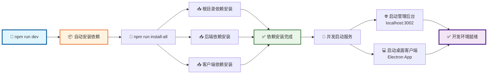
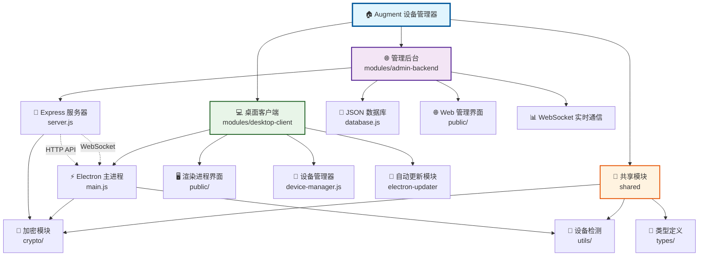
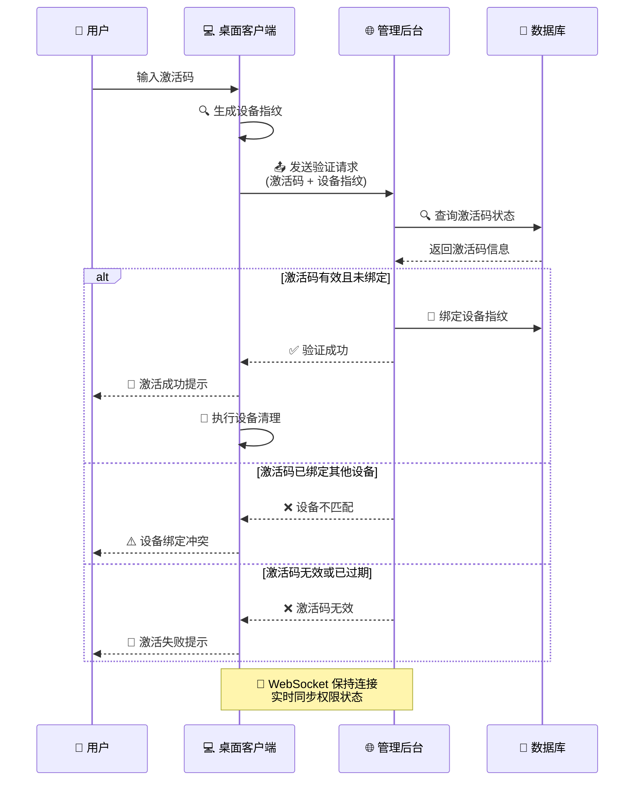
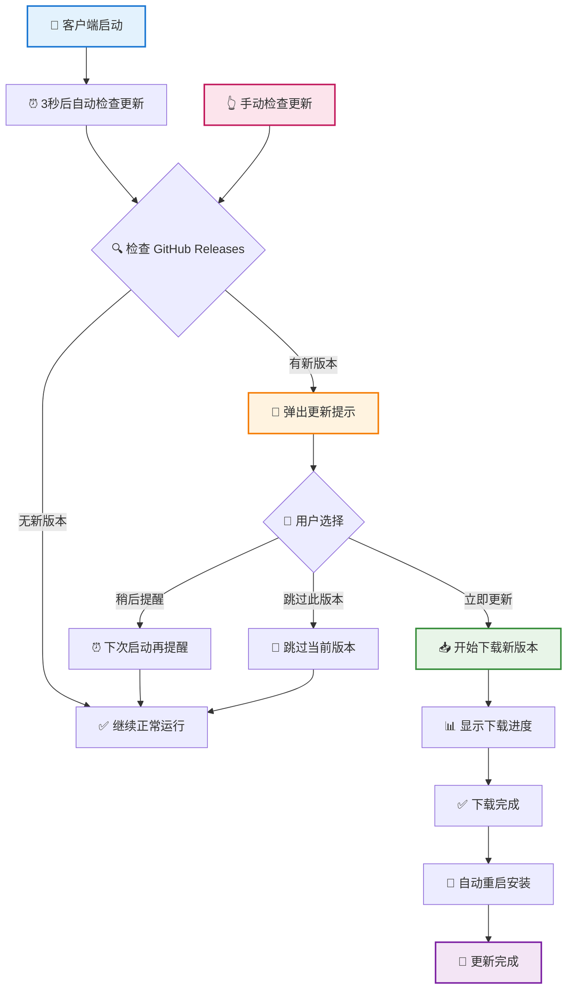

# Augment 设备管理器 - 前后端源码

Cursor IDE Augment 扩展设备限制解决方案，包含激活码管理后台和桌面客户端，支持自
动更新功能、控制任意桌面客户端.

## 🚀 快速启动

### 一键启动（推荐）

```bash
# 自动安装所有依赖 + 启动完整开发环境
npm run dev
```

这个命令会：

- 🔧 自动安装所有项目依赖
- 🌐 启动管理后台服务器 (http://localhost:3002)
- 💻 启动桌面客户端应用

### 启动流程图



### 其他启动方式

```bash
# 仅安装依赖
npm run setup

# 仅启动后端服务器
npm run server-only

# 仅启动客户端
npm run client

# Augment设备管理器清理功能全面测试报告
cd desktop-client && node detailed-test-report.js

📋 node emergency-cursor-reset.js --deep 详细分析
🎯 核心功能
这是一个紧急重置脚本，专门用于解决 Cursor IDE 的"老用户检测问题"，让系统将你识别为全新用户。

🔄 标准模式 vs 深度模式
标准模式 (node emergency-cursor-reset.js)
执行 6 个基础步骤：

强制关闭 Cursor 进程 - 彻底终止所有相关进程
清理 Cursor 数据 - 删除配置目录和本地数据
清理设备 ID 缓存 - 移除项目缓存的设备标识
生成全新设备标识 - 创建新的遥测 ID
设置文件保护 - 对 storage.json 设置只读保护
验证清理效果 - 确认新设备 ID 生效
深度模式 (--deep 参数)
在标准模式基础上，额外执行 5 个激进操作：

清理注册表 - 删除 Windows 注册表中的 Cursor 相关项
清理网络配置 - 刷新 DNS、重置网络栈
清理系统临时文件 - 删除系统级临时文件
清理浏览器数据 - 移除浏览器中的相关数据
重置网络适配器 - 重置网络接口配置
⚠️ 执行后的影响
generate_column_chart_mcp-server-chart
category: 数据清理, value: 100, group: 深度模式 category: 系统影响, value: 85, group: 深度模式 category: 恢复难度, value: 95, group: 深度模式 category: 数据清理, value: 75, group: 标准模式 category: 系统影响, value: 30, group: 标准模式 category: 恢复难度, value: 60, group: 标准模式 category: 数据清理, value: 85, group: 客户端清理 category: 系统影响, value: 15, group: 客户端清理 category: 恢复难度, value: 25, group: 客户端清理 三种清理模式影响对比 影响类型 影响程度 (%) 800 500
🔍 与客户端清理功能的核心区别
特性	紧急重置脚本	客户端清理功能
目标	完全重置，成为新用户	智能清理，保留重要数据
激活状态	❌ 不保留	✅ 默认保留
MCP配置	❌ 完全清理	✅ 自动备份和恢复
系统影响	🔥 激进，可能需要重启	🛡️ 温和，最小化影响
网络配置	🔄 重置网络栈	⚡ 不影响网络
浏览器数据	🗑️ 清理相关数据	🎯 仅清理特定数据
监控机制	❌ 一次性操作	✅ 实时监控防恢复
用户体验	💥 需要重新配置一切	🎨 无缝体验
🚨 深度模式的具体影响
执行 --deep 参数后：

需要重启计算机 - 网络配置重置需要重启生效
网络重新连接 - 可能需要重新连接 WiFi
浏览器重新登录 - 相关网站可能需要重新登录
系统设置重置 - 某些网络相关设置需要重新配置
完全的新用户状态 - Cursor 将完全识别为新设备
💡 使用建议
选择紧急重置脚本的情况：

客户端清理功能失效
需要完全重置为新用户
不在意重新配置的成本
遇到严重的设备识别问题
选择客户端清理功能的情况：

日常使用和维护
希望保留激活状态和配置
需要最小化系统影响
追求用户体验的平衡
```

## ide 的设备 id 恢复机制

IDE 确实会自动恢复旧 ID - 通过创建.vsctmp 临时文件，这个 storage.json.vsctmp 文
件是 Cursor IDE 的原子性写入临时文件写入流程创建

```bash
.vsctmp 临时文件 → 写入新数据 →
重命名为 storage.json → 删除临时文件
```

## 📊 项目架构

### 整体架构图



## 📁 项目结构

```
根目录/
├── modules/                # 主要模块
│   ├── admin-backend/      # 后端服务器
│   └── desktop-client/     # 桌面客户端
├── scripts/                # 脚本文件
│   ├── build/              # 构建脚本
│   ├── setup/              # 设置脚本
│   └── powershell/         # PowerShell脚本
├── tests/                  # 测试文件
│   ├── current/            # 当前活跃测试
│   ├── legacy/             # 旧版测试文件
│   └── integration/        # 集成测试
├── shared/                 # 共享代码模块
├── docs/                   # 项目文档
├── tools/                  # 工具文件
├── package.json            # 项目配置
├── package-lock.json       # 依赖锁定文件
└── node_modules/           # 依赖包
```

## 📋 常用命令

| 命令                       | 功能                                                                    |
| -------------------------- | ----------------------------------------------------------------------- |
| `npm run dev`              | 🚀 一键启动完整开发环境                                                 |
| `npm run setup`            | 📦 安装所有依赖                                                         |
| `npm run server-only`      | 🌐 仅启动远程控制服务器                                                 |
| `npm run build`            | 📦 打包桌面 exe                                                         |
| `npm run build:remote`     | 🚀 一键远程打包，用于分发给不同用户，可以通过扶服务端远程控制任意客户端 |
| `npm run config:update`    | 🔄 自动更新客户端配置（解决 ngrok 地址变化问题）                        |
| `npm run config:watch`     | 👀 实时监听服务器地址变化并自动更新配置                                 |
| `npm run workflow:rebuild` | 🚀 **一键重建客户端**（推荐日常使用）                                   |
| `npm run workflow:quick`   | ⚡ 快速重建客户端                                                       |
| `npm run release`          | 🚀 发布新版本                                                           |

## 🌐 服务地址

- **管理后台**: http://localhost:3002 (admin/admin123)
- **桌面客户端**: 自动启动 Electron 应用

## ✨ 主要功能

### 后端管理系统

- 🔑 激活码生成和管理
- 📊 用户使用记录统计
- 🌐 Web 管理界面
- 🔄 实时远程控制客户端权限

### 桌面客户端

- ✅ 激活码验证和设备绑定
- 🧹 设备指纹清理功能
- 🔄 **自动更新功能**
- 🖥️ 跨平台支持 (Windows/macOS/Linux)

#### 激活码验证流程



### 🔄 自动更新功能

客户端支持完整的自动更新流程：

- **启动检查**: 应用启动后 3 秒自动检查更新
- **用户选择**: 发现新版本时弹出友好提示
  - "立即更新" - 开始下载新版本
  - "稍后提醒" - 下次启动时再次提醒
  - "跳过此版本" - 跳过当前版本
- **下载进度**: 实时显示下载进度条
- **自动安装**: 下载完成后一键重启安装
- **手动检查**: 支持在"关于"页面手动检查更新

#### 自动更新流程图



## 📦 构建打包

### 本地版本打包

```bash
npm run build        # 智能打包：自动检测ngrok并配置远程控制版本
```

### 远程控制版本打包

**方法一：一键远程打包（推荐）**

```bash
npm run build:remote    # 超级一键打包，自动启动服务+ngrok+打包
```

**方法二：手动三步法（最稳定）**

```bash
# 1. 启动后端服务
npm run server-only

# 2. 启动ngrok（新终端窗口）
ngrok http 3002

# 3. 智能打包（自动检测ngrok并配置远程地址）
npm run build
```

**方法三：指定平台打包**

```bash
# 进入客户端目录打包指定平台
cd desktop-client
npm run build:win    # Windows
npm run build:mac    # macOS
npm run build:linux  # Linux
```

### 🔧 打包故障排除

**文件占用问题**：如果遇到 `The process cannot access the file` 错误：

1. 手动删除 `desktop-client/build-output` 目录
2. 重新运行打包命令

**ngrok 检测失败**：

- 确保 ngrok 已启动：`ngrok http 3002`
- 检查 ngrok 状态：访问 http://localhost:4040
- 重新运行打包命令

### 🚀 发布新版本

```bash
npm run release      # 构建并发布到GitHub Releases
```

## 🛠️ 技术栈

- **后端**: Node.js, Express, WebSocket, JSON 存储
- **前端**: Electron, HTML/CSS/JS
- **加密**: AES-256, 设备指纹
- **自动更新**: electron-updater, GitHub Releases
- **跨平台**: Windows/macOS/Linux 支持

## 🌐 远程控制

本项目支持完整的远程控制功能，您可以控制不在同一局域网和地区的客户端。

### ✅ 功能验证

**已验证功能**：

- ✅ 后端服务：成功启动在 3002 端口，API 健康检查正常
- ✅ ngrok 隧道：成功获取公网地址并建立安全连接
- ✅ 智能检测：自动检测 ngrok 并配置远程服务器地址
- ✅ 配置管理：自动备份和恢复客户端配置
- ✅ 远程打包：生成预配置远程服务器地址的安装包
- ✅ 一对多控制：服务端可以远程控制所有客户端
- ✅ 地址变化解决：自动检测并更新 ngrok 地址变化

### 快速开始

**方法一：智能打包（推荐）**

```bash
# 1. 启动后端服务
npm run server-only

# 2. 启动ngrok（新终端）
ngrok http 3002

# 3. 智能打包（自动配置远程地址）
npm run build
```

**方法二：一键远程打包**

```bash
npm run build:remote    # 全自动：启动服务+ngrok+打包
```

**方法三：手动配置**

```bash
# 1. 启动后端服务
npm run server-only

# 2. 使用 ngrok 暴露到公网
ngrok http 3002

# 3. 配置客户端连接远程服务器
npm run configure-client your-ngrok-url.ngrok.io 443 https

# 4. 重新打包客户端
npm run build

# 5. 测试连接
npm run test-connection
```

### ngrok 地址变化解决方案

**问题**：ngrok 免费版地址每次重启都会变化，导致已分发的客户端无法连接。

**解决方案**：

```bash
# 1. 自动更新配置
npm run config:update

# 2. 重新打包
npm run build:remote

# 3. 分发新安装包
```

**一键重建**：

```bash
# 推荐：完整工作流程（检查→更新→验证→清理→打包）
npm run workflow:rebuild

# 快速模式：仅更新配置并打包
npm run workflow:quick
```

**实时监听**：

```bash
# 后台运行，自动检测地址变化
npm run config:watch
```

详细说明请参考：**[📖 下次运行指南](./docs/下次运行指南.md)** |
**[📖 ngrok 地址变化解决方案](./docs/ngrok地址变化解决方案.md)**

### 详细配置

完整的远程控制配置指南请参考
：**[📖 远程控制配置指南](./docs/远程控制配置指南.md)**

支持的部署方案：

- 🚀 **ngrok** - 快速测试，几分钟完成配置（已解决地址变化问题）
- ☁️ **云服务器** - 生产环境推荐
- 🔗 **内网穿透** - frp、花生壳等工具

## 🔧 调试工具

项目提供了多个调试工具，位于 `tools/` 目录：

```bash
# 显示详细的设备指纹信息
node tools/显示设备指纹.js

# 调试设备ID生成函数
node tools/调试设备ID.js

# 简单设备指纹查看
node tools/简单设备指纹.js
```

这些工具可以帮助你：

- 🔍 查看当前设备的指纹信息
- 🧪 测试不同的设备 ID 生成算法
- 🔧 调试设备识别相关问题

## 📋 命令速查

| 命令                       | 功能                    |
| -------------------------- | ----------------------- |
| `npm run dev`              | 🚀 一键启动完整开发环境 |
| `npm run setup`            | 📦 安装所有依赖         |
| `npm run server-only`      | 🌐 仅启动远程控制服务器 |
| `npm run build`            | 📦 打包桌面 exe         |
| `npm run release`          | 🚀 发布新版本           |
| `npm run setup-remote`     | 🌐 远程控制配置向导     |
| `npm run test-connection`  | 🔍 测试远程连接         |
| `npm run configure-client` | ⚙️ 配置客户端服务器     |
| `npm run config:update`    | 🔄 自动更新客户端配置   |
| `npm run config:watch`     | 👀 监听地址变化         |

## 🤝 技术交流

如果您在使用过程中遇到问题或有更好的建议，欢迎交流讨论：

- 📱 关注公众号「**彩色之外**」获取更多开发技巧和工具分享
- 🌐 访问 [个人技术官网](https://zk-99999.netlify.app/welcome.html) - 超级工具等
  你来用
- 🐛 [提交 Issue](../../issues) 报告问题或建议
- ⭐ 觉得项目有用请给个 Star 支持一下

## 📄 许可证

MIT License
