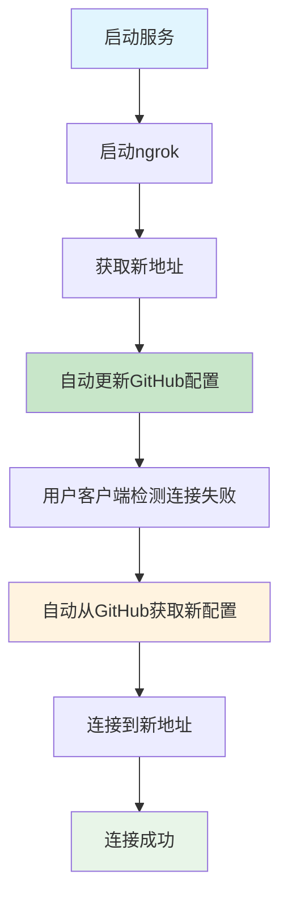

# 🔄 ngrok地址变化解决方案

## 🚨 问题描述

**核心问题**：每次重启ngrok都会生成新地址，导致已分发的客户端无法连接。

```
第一次: npm run build:remote → ngrok地址A → 打包exe(地址A) → 分发给用户
第二次: npm run build:remote → ngrok地址B → 打包exe(地址B) → 旧exe(地址A)失效！
```

## ✅ **最佳解决方案：GitHub自动配置**

### 🎯 **核心思路**
- 客户端从GitHub获取最新服务器地址
- 每次启动ngrok时自动更新GitHub配置
- **一次分发，永久有效**

### 📋 **使用流程**

#### **首次设置（仅需一次）**
```bash
# 1. 在GitHub创建配置仓库（如：augment-config）
# 2. 修改脚本中的GitHub用户名和仓库名
# 3. 使用GitHub方案打包客户端
node scripts/build/build-with-github-config.js
# 4. 分发exe给用户
```

#### **日常使用（每次启动）**
```bash
# 使用自动更新启动脚本
node scripts/server/start-server-with-auto-update.js
```

### 🔄 **工作流程图**



### 📊 **脚本使用说明**

| 场景 | 使用脚本 | 频率 |
|------|----------|------|
| **首次打包分发** | `node scripts/build/build-with-github-config.js` | 仅一次 |
| **日常启动服务** | `node scripts/server/start-server-with-auto-update.js` | 每次启动 |
| **更新客户端功能** | `node scripts/build/build-with-github-config.js` | 需要时 |

### ⚡ **自动化特性**

- ✅ **自动监控地址变化**（每30秒检查）
- ✅ **自动更新GitHub配置**
- ✅ **客户端自动重连**
- ✅ **无需重新分发**

### 🎯 **推荐的package.json配置**

```json
{
  "scripts": {
    "server:start": "node scripts/server/start-server-with-auto-update.js",
    "build:github": "node scripts/build/build-with-github-config.js"
  }
}
```

## 🔧 **详细配置步骤**

### 1. GitHub仓库设置
```bash
# 在GitHub创建新仓库
# 仓库名：augment-config
# 设置为公开仓库（或私有仓库需要token）
```

### 2. 修改脚本配置
```javascript
// 在 scripts/server/start-server-with-auto-update.js 中修改
const GITHUB_CONFIG = {
  owner: "your-username",        // 替换为您的GitHub用户名
  repo: "augment-config",        // 配置仓库名
  branch: "main",                // 分支名
  configFile: "server-config.json", // 配置文件名
  token: process.env.GITHUB_TOKEN || "", // GitHub Token（可选）
};
```

### 3. 可选：设置GitHub Token
```bash
# Windows
set GITHUB_TOKEN=your_token_here

# Linux/macOS
export GITHUB_TOKEN=your_token_here
```

## 🎯 **使用场景解答**

### Q: 每次打包都使用GitHub脚本吗？
**A: 不是**
- **首次打包**：使用 `node scripts/build/build-with-github-config.js`
- **更新客户端功能**：使用 `node scripts/build/build-with-github-config.js`
- **日常启动服务**：使用 `node scripts/server/start-server-with-auto-update.js`

### Q: 每次启动ngrok都使用自动更新脚本吗？
**A: 是的**
- 每次启动服务都使用：`node scripts/server/start-server-with-auto-update.js`
- 这个脚本会自动启动ngrok并更新GitHub配置
- 替代原来的 `npm run server:start`

## 🔄 **完整工作流程**

### 首次部署
```bash
1. 创建GitHub仓库
2. 修改脚本配置
3. node scripts/build/build-with-github-config.js
4. 分发exe给用户
```

### 日常使用
```bash
1. node scripts/server/start-server-with-auto-update.js
2. 服务自动启动，地址自动更新
3. 用户客户端自动获取新地址
```

### 更新客户端
```bash
1. 修改客户端代码
2. node scripts/build/build-with-github-config.js
3. 分发新版本exe
```

## 💡 **关键优势**

- 🎯 **一次分发，永久有效** - 用户永远不需要重新下载
- 🔄 **自动适配地址变化** - ngrok地址变化时客户端自动更新
- 💰 **完全免费** - 利用GitHub免费服务
- 🌍 **全球可用** - 支持不同地区用户访问
- 📱 **智能缓存** - 离线时也能使用上次的地址

## ⚠️ **注意事项**

1. **GitHub仓库必须是公开的**（或设置GitHub Token）
2. **首次设置需要修改脚本中的GitHub配置**
3. **客户端会定期从GitHub获取配置**（每次连接失败时）
4. **建议设置GitHub Token以避免API限制**

---

**总结**：使用GitHub自动配置方案，您可以随时重启ngrok而不影响用户使用，真正实现一次分发永久有效！
