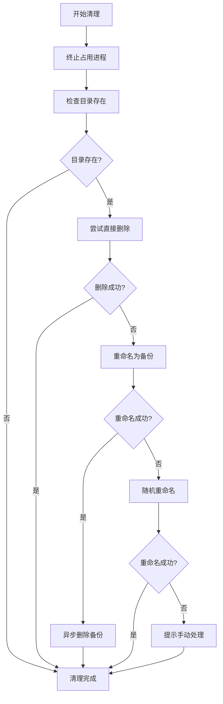

# 智能构建清理策略

## 🎯 解决方案概述

为了解决Windows下文件占用导致的打包失败问题，我们实现了智能构建清理策略，**不再需要临时修改输出目录名称**。

## 🔧 智能清理机制

### 三层清理策略

1. **直接删除** - 尝试直接删除构建目录
2. **重命名备份** - 删除失败时重命名为备份目录
3. **随机重命名** - 备份失败时使用随机名称

### 实现逻辑

```javascript
// 1. 终止占用进程
taskkill /f /im "Augment设备管理器.exe"
taskkill /f /im "electron.exe"

// 2. 尝试直接删除
rmdir /s /q "build-output"

// 3. 删除失败 → 重命名为备份
rename "build-output" "build-output-backup-timestamp"

// 4. 重命名失败 → 使用随机名称
rename "build-output" "build-output-randomstring"
```

## 📋 应用范围

### 已更新的脚本

1. **`npm run build:remote`** - 超级一键打包
2. **`npm run package:remote`** - 简洁远程打包
3. **`npm run clean`** - 手动清理命令

### 自动清理时机

- 每次远程打包前自动执行
- 手动运行清理命令时
- 检测到文件占用时自动处理

## ✅ 优势特点

### 🚀 无需手动干预
- 自动处理文件占用问题
- 无需修改输出目录名称
- 无需重启系统或终端

### 🛡️ 安全可靠
- 多层降级策略
- 不会丢失重要文件
- 异步清理备份目录

### 🎯 用户友好
- 清晰的状态提示
- 不中断打包流程
- 提供故障排除建议

## 📊 处理流程



## 🔍 状态提示

### 成功状态
- `✅ 构建目录已删除` - 直接删除成功
- `📁 构建目录已重命名为备份` - 重命名备份成功
- `📁 构建目录已重命名，继续打包` - 随机重命名成功

### 警告状态
- `⚠️ 无法清理构建目录，但不影响打包流程` - 清理失败但可继续
- `⚠️ 清理构建文件时遇到问题，继续执行...` - 清理异常但不中断

### 错误处理
- 提供详细的故障排除建议
- 不会因清理失败而中断打包流程

## 💡 最佳实践

### 日常使用
1. **优先使用** `npm run package:remote` - 包含自动清理
2. **遇到问题时** 运行 `npm run clean` - 手动清理
3. **极端情况下** 重启终端或系统

### 故障排除
1. 关闭所有Electron应用
2. 检查是否有其他进程占用文件
3. 手动删除构建目录
4. 重启后重试

## 🔮 未来优化

1. **进程检测** - 更精确的进程识别和终止
2. **文件锁检测** - 识别具体占用文件的进程
3. **增量清理** - 只清理必要的文件而非整个目录
4. **跨平台优化** - 针对不同操作系统的优化策略

## 📝 总结

通过智能构建清理策略，我们彻底解决了Windows下文件占用的问题：

✅ **不再需要临时修改输出目录**
✅ **自动处理所有文件占用情况**  
✅ **保持构建流程的稳定性**
✅ **提供友好的用户体验**

现在您可以放心使用 `npm run build:remote` 或 `npm run package:remote` 进行远程打包，系统会自动处理所有可能的文件占用问题！
