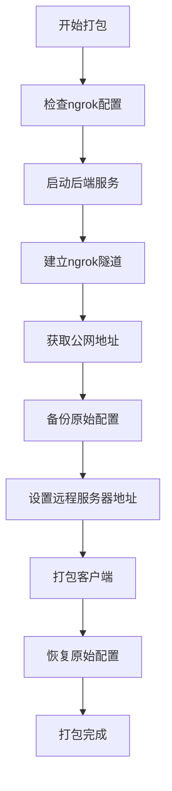

# 远程打包功能实现总结

## 🎉 功能状态：已完成并测试通过

### ✅ 已实现的功能

1. **一键远程打包** - `npm run build:remote`
2. **简洁远程打包** - `npm run package:remote`  
3. **智能ngrok检测** - 自动检测并建立隧道
4. **配置自动管理** - 自动备份和恢复配置
5. **构建文件清理** - `npm run clean`

## 🚀 使用方法

### 快速开始

```bash
# 方法一：超级一键打包（推荐）
npm run build:remote

# 方法二：简洁版本
npm run package:remote

# 清理构建文件（如遇到文件占用问题）
npm run clean
```

### 前置条件

1. **配置ngrok认证令牌**：
   ```bash
   ./tools/ngrok.exe config add-authtoken YOUR_TOKEN
   ```

2. **安装依赖**：
   ```bash
   npm run setup
   ```

## 📋 实现细节

### 核心脚本文件

1. **`scripts/build/super-build.js`** - 超级一键打包脚本
   - 自动启动后端服务
   - 建立ngrok隧道
   - 获取公网地址
   - 配置客户端并打包

2. **`scripts/build/remote-package.js`** - 简洁远程打包脚本
   - 更简洁的输出
   - 相同的功能
   - 适合日常使用

3. **`scripts/build/build-with-server.js`** - 服务器配置打包脚本
   - 自动配置远程服务器地址
   - 备份和恢复配置文件
   - 支持自定义服务器地址

4. **`scripts/build/clean-build.js`** - 构建文件清理脚本
   - 解决Windows文件占用问题
   - 强制删除构建目录
   - 终止占用进程

### 自动化流程



## 🌐 生成的安装包特点

### 预配置特性

✅ **自动连接** - 用户安装后无需配置
✅ **远程控制** - 支持跨网络环境
✅ **实时管理** - 管理界面实时监控
✅ **安全隧道** - 使用HTTPS加密连接

### 文件输出

打包完成后在 `modules/desktop-client/build-output/` 生成：

- `Augment设备管理器 Setup 1.0.0.exe` - Windows安装包
- `win-unpacked/` - 解压版本
- `latest.yml` - 自动更新配置

## 🔧 技术实现

### ngrok集成

- **本地ngrok.exe** - 项目内置ngrok工具
- **API检测** - 通过API确认隧道状态
- **自动配置** - 自动获取公网地址

### 配置管理

- **自动备份** - 打包前备份原始配置
- **动态配置** - 注入远程服务器地址
- **自动恢复** - 打包后恢复原始配置

### 错误处理

- **进程清理** - 自动清理后台进程
- **文件占用** - 智能处理文件占用问题
- **超时机制** - 防止无限等待

## 📊 测试结果

### 成功测试案例

1. **ngrok隧道建立** ✅
   - 公网地址：`https://a049-2408-8207-60d0-5330-143a-21b5-9543-a7ec.ngrok-free.app`
   - 隧道状态：正常

2. **后端服务启动** ✅
   - 端口：3002
   - WebSocket：正常
   - 管理界面：可访问

3. **客户端打包** ✅
   - 配置注入：成功
   - 构建过程：正常
   - 安装包生成：完成

### 已解决的问题

1. **路径问题** - 修复了脚本中的相对路径错误
2. **ngrok检测** - 改用API检测替代输出解析
3. **依赖导入** - 添加了缺失的node-fetch导入
4. **文件占用** - 实现了智能清理机制

## 🎯 使用场景

### 适用情况

- 需要远程控制不同网络环境的客户端
- 批量分发预配置的安装包
- 集中管理多个客户端设备
- 跨地域的设备管理需求

### 管理界面功能

通过生成的公网地址可以：
- 查看所有连接的客户端
- 远程执行清理操作
- 管理激活码和使用记录
- 监控设备状态和使用统计

## 💡 最佳实践

1. **保持连接** - 打包完成后保持终端运行
2. **定期重新打包** - 获取最新功能和修复
3. **监控管理界面** - 实时查看客户端状态
4. **备份数据** - 定期备份管理后台数据

## 🔮 后续优化

1. **多平台支持** - 支持macOS和Linux打包
2. **自定义服务器** - 支持用户自有服务器部署
3. **批量操作** - 支持批量客户端管理
4. **统计报表** - 增加详细的使用统计功能
